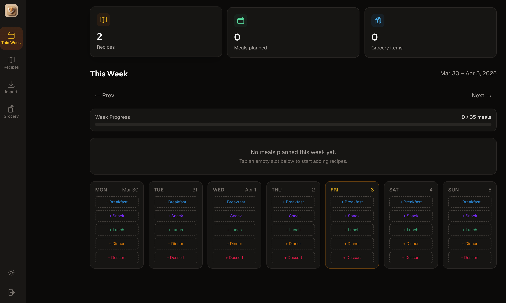
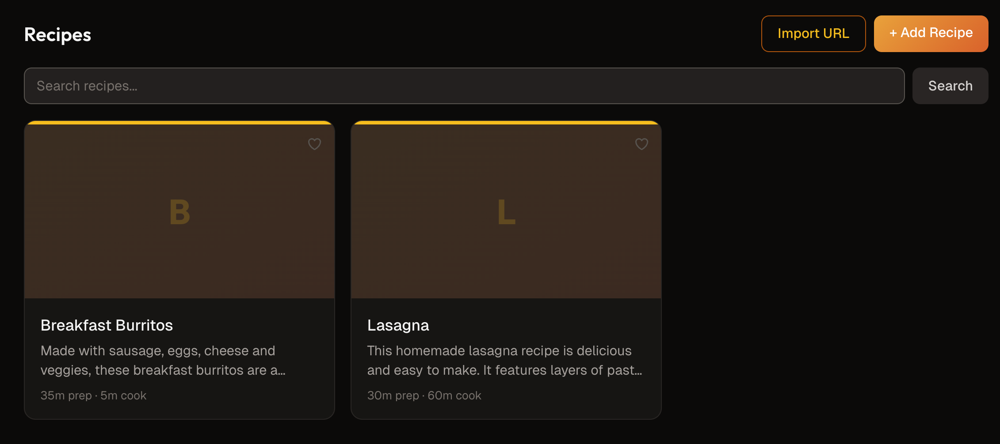
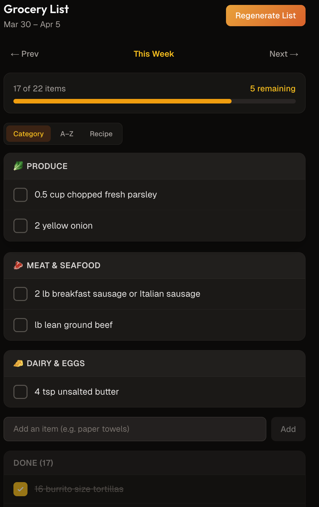
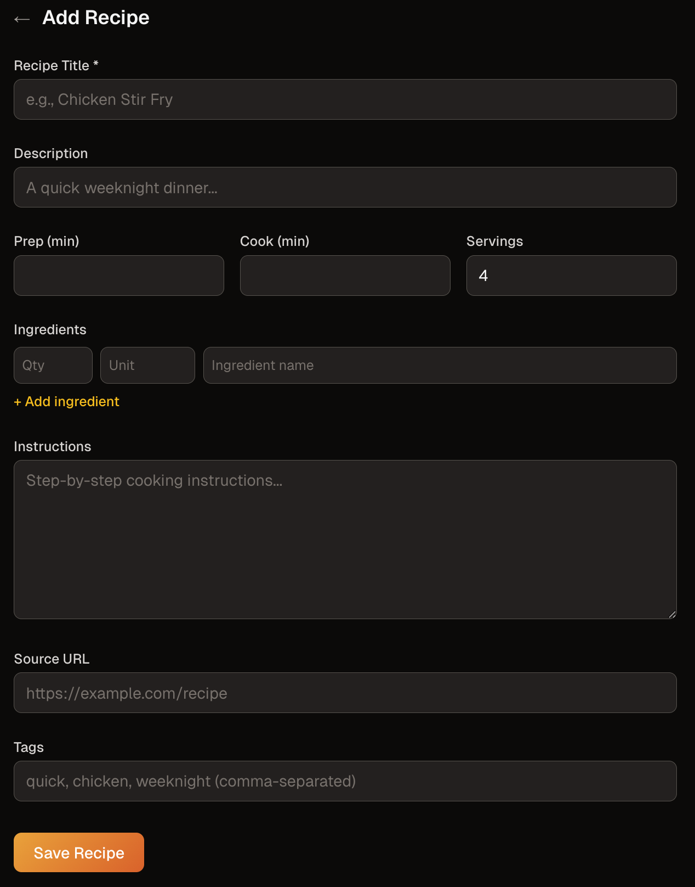
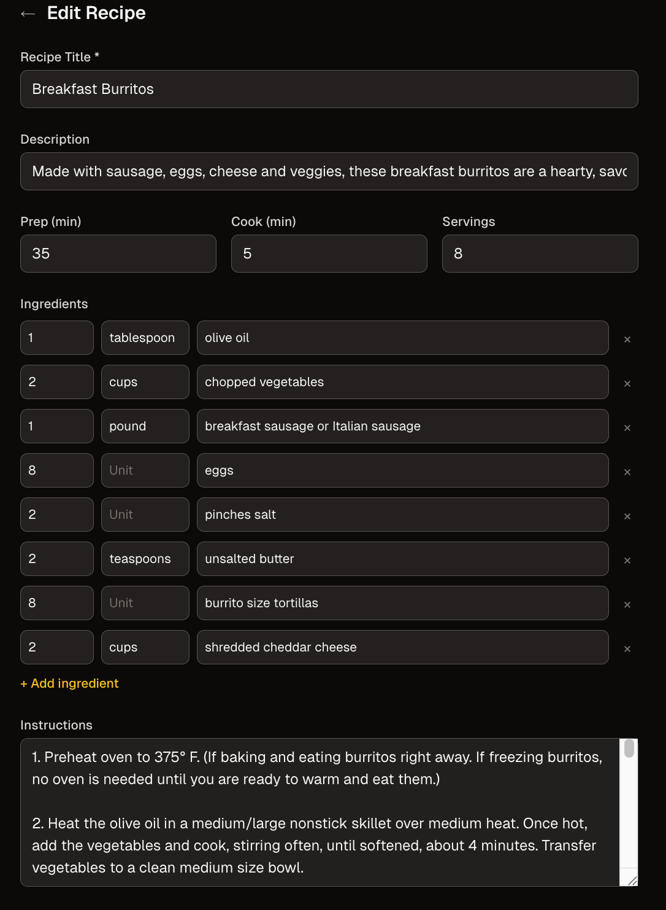
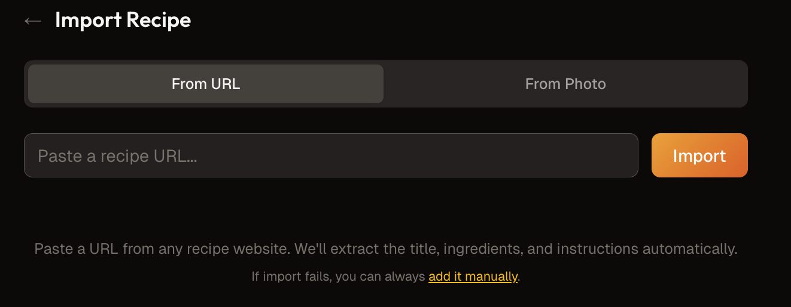

# kDOUGH — Meal Planner

An open-source meal planning and grocery list app. Plan your week, import recipes from any URL, and generate an organized grocery list in one tap.

## Screenshots

### Weekly Meal Planner

The main dashboard — plan meals by dragging recipes onto a weekly calendar grid. Shows today's highlight, week navigation, and a summary bar with meal counts.

### Recipe Collection

Browse your saved recipes with search, import from URL, or add manually. Cards show title, description, and prep/cook times.

### Grocery List

Auto-generated grocery list from your week's meal plan. Items grouped by aisle category (Produce, Meat & Seafood, Dairy & Eggs, etc.) with a progress bar and sort toggle (Category / A-Z / Recipe).

### Add & Edit Recipes

Create recipes manually with title, description, prep/cook time, ingredients, instructions, source URL, and tags.


Edit existing recipes — full ingredient list with quantity, unit, and name fields.

### Import Recipes

Import recipes from any URL or snap a photo. The app automatically extracts title, ingredients, and instructions.

---

## The Core Loop

```
ADD RECIPES → PLAN THE WEEK → GENERATE LIST → SHOP
```

1. **Add recipes** — Import from URL, type manually, or snap a photo (OCR)
2. **Plan the week** — Drag recipes onto a weekly calendar (dinner-focused)
3. **Generate list** — One tap produces a consolidated, category-sorted grocery list
4. **Shop** — Check off items in-store from a clean, mobile-friendly list

## Tech Stack

| Layer      | Choice   | Why                                              |
|------------|----------|--------------------------------------------------|
| Frontend   | Next.js  | Fast, flexible, great ecosystem                  |
| Backend/DB | Supabase | Auth, Postgres database, real-time out of the box|
| Desktop    | `.dmg`   | Clean native install on MacBook Air               |
| Future     | iPhone   | Mobile access for planning and shopping           |

## Prerequisites

- **Node.js** 18+ and npm
- **Supabase account** (free tier works) — [supabase.com](https://supabase.com)
- **Anthropic API key** (optional) — only needed for AI-assisted recipe import

## Getting Started

### 1. Clone the repo

```bash
git clone <repo-url>
cd kDOUGH/app
```

> **Note:** All source code, configs, and scripts live in the `app/` subdirectory. The project root contains documentation only.

### 2. Install dependencies

```bash
npm install
```

### 3. Set up environment variables

Copy the example env file and fill in your values:

```bash
cp .env.example .env.local
```

Required variables:

```
NEXT_PUBLIC_SUPABASE_URL=https://your-project.supabase.co
NEXT_PUBLIC_SUPABASE_ANON_KEY=your-anon-key
```

Optional (for AI-assisted recipe import):

```
ANTHROPIC_API_KEY=your-anthropic-api-key
```

### 4. Start the dev server

```bash
npm run dev
```

Open [http://localhost:3000](http://localhost:3000) — you should see the login page.

## Project Documentation

| File                     | Purpose                                                |
|--------------------------|--------------------------------------------------------|
| `README.md`              | This file — setup and orientation                      |
| `ARCHITECTURE.md`        | Folder structure, database schema, data flow           |
| `CHANGELOG.md`           | Running log of what got done and when                  |
| `DECISIONS.md`           | Non-obvious technical choices and reasoning            |
| `ROADMAP.md`             | Completed phases + future feature roadmap              |
| `CONTRIBUTING.md`        | How to contribute — setup, branches, PR guidelines     |
| `SECURITY.md`            | Vulnerability reporting and security practices         |

## Scripts

All scripts run from the `app/` directory.

| Command                     | Description                                  |
|-----------------------------|----------------------------------------------|
| `npm run dev`               | Start development server                     |
| `npm run build`             | Production build                             |
| `npm run start`             | Start production server                      |
| `npm run lint`              | Run ESLint                                   |
| `npm run electron:dev`      | Run app in Electron (dev mode)               |
| `npm run electron:build`    | Build `.dmg` for macOS (arm64 + x64)         |
| `npm run electron:build:dir`| Build unpacked app (for testing)             |

### Building the `.dmg`

On a macOS machine:

```bash
cd app
npm install
npm run electron:build
```

The `.dmg` file will be in `app/dist/`. Double-click to mount and drag to Applications.

**Note:** The Electron build bundles the Next.js standalone output. `NEXT_PUBLIC_*` environment variables are baked in at build time. The `ANTHROPIC_API_KEY` (if used) must be present in `.env.local` before building.

### Supabase Auth Setup

The app uses **email/password** authentication. For the Electron app and web dev:

1. Go to your [Supabase Dashboard](https://supabase.com/dashboard) → Project → Authentication → URL Configuration
2. Under **Redirect URLs**, add:
   - `http://localhost:3000/**` (development)
   - `http://localhost:3847/**` (Electron dev)
3. Ensure Email auth is enabled under Authentication → Providers

### macOS Gatekeeper (Unsigned App)

The `.dmg` is not code-signed or notarized. macOS will block it on first launch. To open:

1. Double-click the `.dmg` and drag kDOUGH to Applications
2. **Right-click** (or Control-click) the app in Applications
3. Choose **Open** from the context menu
4. Click **Open** in the dialog that appears

You only need to do this once. After the first launch, macOS remembers your choice.

## Contributing

Contributions are welcome! See [CONTRIBUTING.md](CONTRIBUTING.md) for guidelines.

Please read our [Code of Conduct](CODE_OF_CONDUCT.md) before participating.

## License

MIT License. See [LICENSE](LICENSE) for details.
